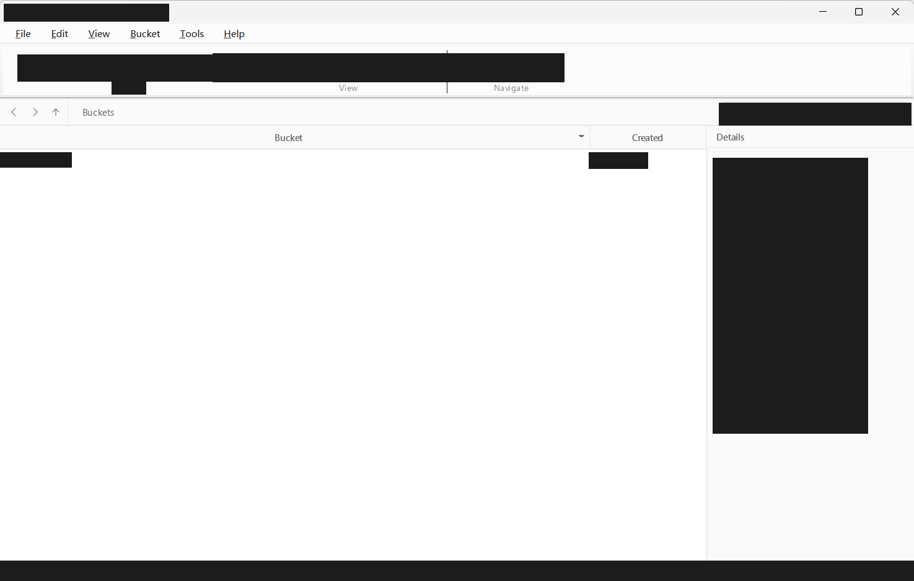

<div align="center">


# S3 Desktop

**A fast, native desktop client for S3 and S3-compatible object storage.**

UCloud US3 · AWS S3 · MinIO · anything that speaks the S3 API

[](LICENSE)
[](#build)
[](https://www.qt.io/)
[](#build)

**English** | [中文](README.zh-CN.md)

</div>

---

S3 Desktop is a **Qt rewrite** of an earlier MIT-licensed Go/Fyne client for
S3-compatible storage. It is not a port: no line of the original Go/Fyne code was
translated. The feature set was reimplemented from scratch on top of Qt 6 and a
hand-written SigV4 signer, because the original's structure — a single 1150-line
window that called into a vendor SDK from a background goroutine — is what made
its bugs hard to fix in the first place.

## Screenshot



## Contents

- [Screenshot](#screenshot)
- [What it does](#what-it-does)
- [Differences from the original, and why](#differences-from-the-original-and-why)
- [Build](#build)
- [Static build](#static-build)
- [Tests](#tests)
- [Logs](#logs)
- [Layout](#layout)
- [Versioning](#versioning)
- [License](#license)

## What it does

| | |
|---|---|
| **Connections** | Named profiles saved locally: endpoint, access key, secret key, bucket, region, prefix, TLS, addressing style. Test-connection button in the dialog. |
| **Browse** | Bucket list, then a folder-grouped object table with breadcrumb navigation and back/forward/up history (`Alt+Left` / `Alt+Right` / `Alt+Up`). |
| **Bucket root** | A connection that names no bucket opens on the account's bucket list — its own level, with its own breadcrumb, not a stand-in for a key prefix. Opening a bucket shows its objects and rewrites the path to `Buckets › bucket › folder › …`; the crumb and `Alt+Up` go back up to the list. |
| **Search & sort** | Client-side filter over the loaded objects; locale-aware, digit-aware sorting by name, size, or modified time. Folders always sort before files. |
| **Paginate** | Objects load 500 at a time, continuing from where the last page ended; **Load more** appends instead of replacing, so a 50 000-object bucket stays responsive. |
| **Details** | Key, size, modified time, ETag, and storage class for the selected row. |
| **Transfers** | Upload and download queue with per-item progress and cancel, run through `QNetworkAccessManager` so the UI thread is never blocked. |
| **Sharing** | Presigned GET URLs, valid for one hour, generated locally without a round trip. |
| **Buckets** | Create and delete buckets from a separate manager window, with client-side name validation. |
| **CLI** | `--endpoint`, `--access-key`, `--secret-key`, `--bucket`, `--prefix`, `--region`, `--target`, `--ssl` / `--no-ssl`. Each falls back to the `ENDPOINT`, `ACCESS_KEY`, `SECRET_KEY`, … environment variables the original used. |

## Differences from the original, and why

**No vendor SDK.** Signatures are computed with `QCryptographicHash` and
`QMessageAuthenticationCode` against the published SigV4 specification. The
signer is verified against AWS's own test vectors in the test suite, so a
provider that rejects a request can be distinguished from a signer that is wrong.

**No worker threads.** Every request goes through the event loop; replies are
delivered to the GUI thread by construction. The original called its UI toolkit
from goroutines, which is the source of most of its stability problems.

**Credentials in DPAPI.** Secret keys are encrypted with `CryptProtectData`
(Windows Data Protection API), so they are readable only by the user account that
stored them. The original kept them in plaintext JSON. `CredentialStore` is a
single interface, so another platform's keychain can be substituted without
touching callers.

**Provider differences are data, not branches.** `TargetProfile` describes how a
given provider lays out hostnames and derives a region — US3's
`s3-<region>.ufileos.com`, AWS, MinIO, generic path-style — instead of scattering
`if provider ==` checks through the transport layer.

**A virtualised table.** `ObjectModel` keeps one index list over the loaded
objects and never copies them; `QTableView` renders only visible rows. Fixed row
height lets Qt compute visibility without querying the model per row, which is
what keeps very large listings usable.

## Build

**Requirements:** Qt 6 (Core, Gui, Widgets, Network — and Test for the suite),
CMake 3.21+, and a C++17 compiler.

Verified with Qt 6.9.3 (mingw_64), GCC 13.1.0, CMake 4.0.1, and Ninja on Windows
11.

```sh
cmake -S . -B build -G Ninja -DCMAKE_BUILD_TYPE=Release \
      -DCMAKE_PREFIX_PATH=C:/Qt/6.9.3/mingw_64
cmake --build build
```

> [!NOTE]
> The binary lands at `build/s3desktop.exe`. On Windows it is built as a GUI
> subsystem executable, so it will not attach a console window.

## Static build

A single self-contained `.exe` with no Qt DLLs beside it — nothing to install,
nothing to put on `PATH`, nothing to break when a redistributable is missing.

Qt's own MinGW packages ship **import libraries**, not static ones: every member
of their `libQt6Core.a` is named `Qt6Core_dll_*.o`, so `-static` can only resolve
the references, never eliminate the DLL dependency. A genuinely static Qt has to
be built from source:

```sh
# configure.bat in a qtbase source tree
configure.bat -static -static-runtime -release -opensource -confirm-license \
              -nomake examples -nomake tests -no-dbus -no-icu -platform win32-g++
# then, with Ninja
cmake --build . --parallel
cmake --install . --prefix C:/Qt/6.9.3/mingw1310_64_static
```

Then point the project at that prefix and turn the option on:

```sh
cmake -S . -B build-static -G Ninja -DCMAKE_BUILD_TYPE=Release \
      -DCMAKE_PREFIX_PATH=C:/Qt/6.9.3/mingw1310_64_static \
      -DS3DESKTOP_STATIC=ON
cmake --build build-static
```

`S3DESKTOP_STATIC` is off by default and deliberately not inferred from the
Qt install: a static Qt is a separate prefix, and guessing from `Qt6Core_LIBRARIES`
would make the build silently change character when `CMAKE_PREFIX_PATH` moves.

> [!IMPORTANT]
> A static Qt links **no plugins by default**. Without importing the Windows
> platform plugin the executable compiles and links cleanly, then dies at startup
> with *"no Qt platform plugin could be initialized"*. The build imports
> `QWindowsIntegrationPlugin`, `QModernWindowsStylePlugin`,
> `QSchannelBackendPlugin` (TLS), and the ICO/JPEG/GIF image formats by type;
> under MinGW it also passes `-static` so libgcc, libstdc++ and libwinpthread are
> bound in rather than left as DLLs.

Result: `s3desktop.exe` at ~51 MB, importing only Windows system DLLs — no
`Qt6*.dll`, no `libgcc_s_seh-1.dll`, no `libstdc++-6.dll`, no
`libwinpthread-1.dll`.

## Tests

```sh
ctest --test-dir build --output-on-failure
```

> [!IMPORTANT]
> The test binaries link Qt dynamically, so Qt's `bin` directory has to be on
> `PATH` (`C:/Qt/6.9.3/mingw_64/bin`); without it they exit with `0xc0000135`
> before running a single case. A `-DS3DESKTOP_STATIC=ON` build has no such
> requirement — the suite runs with nothing but `C:\Windows\system32` on `PATH`.

Six suites, none of which need a display or a network:

| Suite | Covers |
|---|---|
| `test_sigv4` | The signer, against AWS's worked examples and test-suite vectors |
| `test_list_parser` | XML listing responses, including provider quirks and error-code mapping |
| `test_target_profile` | Hostname layout and region derivation per provider |
| `test_transfer_queue` | The transfer state machine |
| `test_object_model` | Filtering, folder grouping, sorting, and bucket mode |
| `test_object_browser` | Back/forward/up, the breadcrumb at every level, and which rows the object commands are allowed to see |

## Logs

Every run writes `s3desktop.log` beside `settings.json` — on Windows that is
`%LOCALAPPDATA%\s3desktop\s3desktop\`. The previous run is kept as
`s3desktop.log.1`.

Each request records the URL that was actually built, the host that was actually
signed, the port used, and the credential store's verdict on the secret. A
failure adds the HTTP status, the server's `<Code>` and request id, and the
response body, which for a signature problem is the only place the real reason
appears. Secrets are redacted to four characters and two.

Set `S3DESKTOP_LOG` to override the path, or to `off` to turn logging off.

## Layout

```
src/core/     transport, signing, config, credentials, transfers  (no GUI)
src/compat/   provider profiles
src/ui/       widgets, models, theme
tests/        Qt Test suites
```

`core` and `compat` link only against Qt Core/Network, so all of the logic that
can be wrong without a user noticing is testable in isolation. `ui` is a separate
static library so the model and theme can be exercised under a `QApplication`
without opening the main window.

## Versioning

`VERSION` holds the current release, one bare number per line. The **Check for
updates** action fetches that file from this repository's default branch and
compares it against the version compiled into the binary; if this build is older
it offers to open the project page. Bumping a release means editing `VERSION`
and `kVersion` in `src/ui/MainWindow.cpp` together.

## License

MIT, as the original. See [LICENSE](LICENSE).
